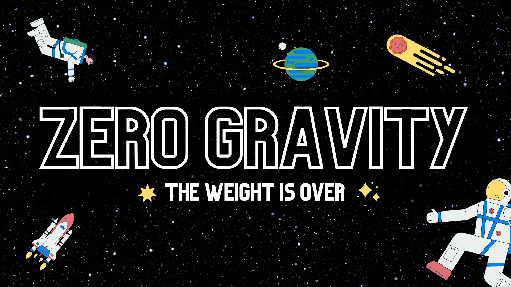

Zero Gravity is a system for proving an inference pass (i.e. a classification) for a pre-trained, public Weightless Neural Network run on a private input.  Zero Gravity builds upon the recent BTHOWeN model by [Susskind et al (2022)](https://arxiv.org/abs/2203.01479), in which the authors improve upon earlier WNN models in a number of interesting ways.  Most importantly for this hackathon project, they helpfully provide an [implementation](https://github.com/ZSusskind/BTHOWeN) complete with pre-trained models and reproducible benchmarks.

See our [blog post](https://hackmd.io/@77sjNbqjST6HRnGPQyY9Dw/BkNGwbUW3) for an extensive description!

Built as part of the ZKHack hackathon, Lisbon, 2023.

## Setup

Clone and install the [custom aleo compiler](git@github.com:zkp-gravity/aleo-setup.git) supporting lookup arguments

## Usage
```
python3 generate_main.py
../aleo-setup/aleo/target/debug/aleo run main "$(cat input_bits.txt)" "$(cat hash_digest_bits.txt)" "$(cat bloom_filter_bits.txt)" 
```

```
python3 generate_aleo_code.py 56
../aleo-setup/aleo/target/debug/aleo run main "$(cat inputs.txt)" "$(cat hash_bits.txt)" "$(cat inputs/bloom_filter_bits.txt)" $(cat max_discriminator.txt) "$(cat max_discriminator_index.txt)"
```
